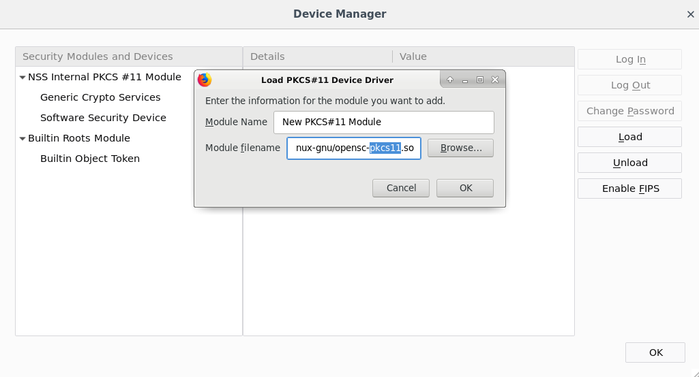

# smartcard_fu

`aptitude install libpam-pkcs11 opensc-pkcs11 pcscd`

`cp -r pam_pkcs11 /etc`

`vim /etc/pam_pkcs11/subject_mapping`

`pkcs11_inspect debug` can be used to output the Subject on the SSL certificate. put that in `subject_mapping`

you might want to use your own CA certificate.

WARNING: NEVER TURN OFF CA VERIFICATION IN `/etc/pam_pkcs11/pam_pkcs11.conf` (`cert_policy = none;`)

add this line to the relevant `pam` files:

`auth	sufficient	pam_pkcs11.so`

`pam.d/` includes examples.

# ssh

`ssh-add -s /usr/lib/x86_64-linux-gnu/opensc-pkcs11.so` will load your smart card SSL certificate into `ssh-agent`

`ssh-add -L` will then list it.

you can also use `ssh -I /usr/lib/x86_64-linux-gnu/opensc-pkcs11.so user@host`

# getting a certificate

`yubico-piv-tool -s 9a --action generate -o public.pem`

`yubico-piv-tool -S "/CN=neoice.users.neoice.net/" -s 9a --action verify --action request-certificate -i public.pem`

# Firefox

you can also load Smart Card support into Firefox

# udev

you can use `udev` to lock on device removal. you need to expose the serial number over the USB descriptor. TODO: provide instructions.

WARNING: launching tools that program the device will trigger a device removal. you might have to disable these rules. I've caused myself to loop.

TODO: more instructions, I don't want to troubleshoot your broken stuff.

# remote desktop

you must use `rdesktop` and you need this package too: `libfreerdp-plugins-standard`

example: `rdesktop -r scard -g 1400x1200 -d REALM aa.bb.cc.dd`
